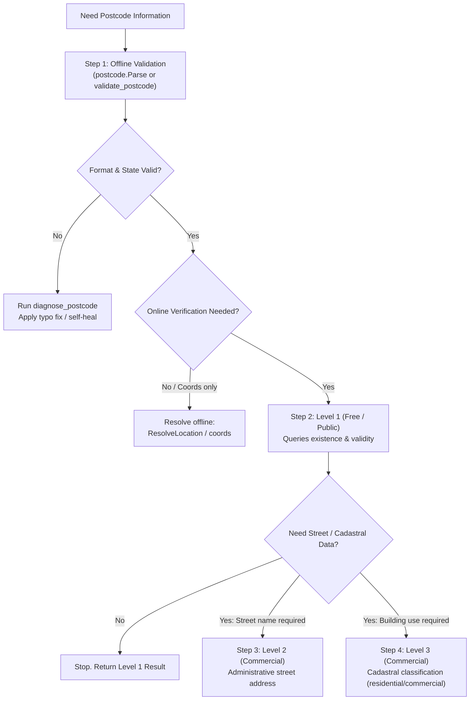

# Nigerian Postcode Engineering Skill (`nipost-postcode`)

This skill equips agents with domain expertise, cost-aware execution protocols, and self-healing procedures for Nigeria's 11-character National Digital Alphanumeric Postcode system, operated by the Nigerian Postal Service (**NIPOST**).

---

## 1. Postal Grammar & Structural Anatomy

Every post-2023 Nigerian digital postcode is an **11-character alphanumeric code** partitioned into five hierarchical segments:

$$\mathbf{\underbrace{LA}_{\text{State}}-\underbrace{11}_{\text{LGA}}-\underbrace{W06}_{\text{District}}-\underbrace{TC}_{\text{Area}}-\underbrace{10}_{\text{Unit}}}$$

| Segment | Length | Type | Valid Range | Rule / Notes |
| :--- | :--- | :--- | :--- | :--- |
| **State** (`SS`) | 2 | Alpha | `[A-Z]{2}` | Must match one of 37 recognized entities (36 states + `FC` for FCT Abuja). |
| **LGA** (`LL`) | 2 | Numeric | `01`-`99` | **Cannot be `00`**. Single-digit inputs (e.g. `1`) must be zero-padded to `01`. |
| **District** (`DDD`) | 3 | Alphanumeric | `[A-Z0-9]{3}` | Postal delivery district identifier. |
| **Area** (`AA`) | 2 | Alpha | `[A-Z]{2}` | Local delivery zone or neighborhood area. |
| **Building / Unit** (`UU`) | 2 | Numeric | `01`-`99` | **Cannot be `00`**. Physical building or delivery point unit. |

> [!WARNING]
> **Deprecated 6-Digit Codes**: Older 6-digit numeric codes (e.g., `100001` for Ikeja) were phased out under the modern national alphanumeric cadastral system. Always guide users to the canonical 11-character format.

---

## 2. Tooling Selection Matrix

When executing tasks, pick the most appropriate tool surface:

| Use Case / Environment | Recommended Tool | Interface & Method |
| :--- | :--- | :--- |
| **Interactive LLM / IDE Session** *(Claude, Cursor, Antigravity)* | **MCP Server** | Tools: `validate_postcode`, `lookup_postcode`, `reverse_geocode`, `diagnose_postcode` |
| **Go Codebases & Backend Services** | **Go SDK** (`postcode`) | `github.com/abcubed3/postcode` (zero-allocation `postcode.Parse`, `client.Lookup`) |
| **Data Cleaning, CSV ETL, Shell Scripts** | **CLI** (`postcode`) | `postcode batch`, `postcode validate`, `postcode coords`, `postcode reverse` |
| **Browser / Node.js / Cloudflare Workers** | **WebAssembly Engine** | `wasm/postcode.wasm` via `wasm/index.js` (offline zero-latency execution) |

---

## 3. Cost-Aware Escalation Protocol (Protect API Credits)

The NIPOST Gateway (`GET /v1/lookup`) employs a **graded response model**. Commercial queries consume paid account credits. Autonomous agents must strictly adhere to this escalation ladder:



### Golden Rules for Quota Conservation:
1. **Never default to Level 2 or 3**: Default parameter for `lookup_postcode` must always be `level: 1`. Only pass `level: 2` or `level: 3` when the user explicitly requests street-level cadastral details or property classification.
2. **Offline-First Coordinates**: For general proximity or mapping, use `resolve_location` or `postcode.Coordinates()`. They resolve local administrative centroids with **zero network calls and zero cost**.
3. **Handle 402 & 429 Gracefully**: When receiving `402 Payment Required` (insufficient credits) or `429 Too Many Requests`, immediately fall back to offline resolution rather than failing the prompt.

---

## 4. Unstructured Address Disambiguation SOP

Real-world Nigerian addresses are notoriously descriptive (e.g., *"Plot 14, beside Total Filling Station, Opposite Phase 2 Gate, Lekki, Lagos"*). Execute this 5-step pipeline:

1. **Extract State Candidate**:
   - Normalize state name (e.g. "Abuja" or "FCT" $\to$ `FC`, "Port Harcourt" $\to$ Rivers State `RI`, "Ikeja" $\to$ Lagos `LA`).
   - Use `list_states` if unsure.
2. **Identify LGA & District**:
   - Call `list_lgas(state: "LA")` to match administrative division (e.g. Eti-Osa).
   - If partial postcode text exists (e.g. `LA 11`), call `autocomplete_postcode(query: "LA 11")` to view active segments.
3. **Spatial Snapping (If Coordinates / Map Link Provided)**:
   - Call `reverse_geocode(latitude, longitude, max_distance_m: 100)` to snap to the closest building unit.
4. **Synthesize Postcode**:
   - Assemble segments using `assemble_postcode(state, lga, district, area, unit)`. Single digits (e.g. LGA 4) are automatically padded to `04`.
5. **Sanity Check & Format**:
   - Ensure the final code matches canonical hyphenation (`LA-11-W06-TC-10`).

---

## 5. Diagnostic Self-Healing Loop

Traditional validators return binary boolean errors. This toolkit provides `postcode.Diagnose` (`diagnose_postcode`), generating structured guidance and Levenshtein typo corrections.

### The Self-Healing Loop:
```
1. Validate postcode candidate.
2. If invalid: Call diagnose_postcode(code).
3. Read the `format_score` (0-100) and `actionable_tip`.
4. Inspect `diagnoses` array:
   - If State error: Check `suggestions` (e.g. "ZZ" -> closest state is "ZA" Zamfara).
   - If LGA is "00": Correct to "01" or prompt user for LGA number.
   - If Segment length mismatch: Re-align segment boundaries.
5. Apply suggested fix and re-validate before reporting back.
```

---

## 6. Practical Implementation Recipes

### A. Go SDK (Idiomatic & Zero-Allocation)

```go
// 1. High-speed offline parsing (0 allocs, ~28ns)
p, err := postcode.Parse("LA-11-W06-TC-10")
if err != nil {
    // Self-correct via diagnostics
    report := postcode.Diagnose("LA-11-W06-TC-10")
    log.Printf("Tip: %s", report.ActionableTip)
}
fmt.Println(p.State(), p.LGA(), p.Formatted())

// 2. Client with commercial quota guardrails & cache
client, err := postcode.NewClient(
    postcode.WithAPIKey(os.Getenv("POSTCODE_API_KEY")),
    postcode.WithDefaultCache(), // 1000 items, 30m TTL
    postcode.WithAgentGuard(postcode.AgentGuardConfig{
        MaxCommercialCallsPerRun: 10,
        AutoDowngradeToLevel1:    true,
        AutoFallbackToOffline:    true,
    }),
)
```

### B. Command-Line (CLI) Automation

```bash
# Offline instant validation & diagnostics
postcode validate "LA-11-W06-TC-10"
postcode diagnose "ZZ-00-A03-FK-00" --format json

# Reverse geocoding & nearby discovery
postcode reverse --lat 6.4281 --lng 3.4219 --json
postcode nearby --code "LA-08-A86-RG-01" --radius 200

# High-throughput CSV cleaning (10,000+ rows/sec)
postcode batch input_addresses.csv --column postcode --out cleaned.csv --workers 8
```

### C. MCP Tool Calling

When connected to the `postcode` MCP server:
```json
// Free format & existence check
{
  "name": "lookup_postcode",
  "arguments": {
    "code": "EK-01-A03-FK-01",
    "level": 1
  }
}

// Coordinate resolution (Offline Centroid)
{
  "name": "resolve_location",
  "arguments": {
    "code": "LA-11-W06-TC-10"
  }
}
```

---

## 7. Reference Files

For in-depth domain specifics and reference tables, consult:
- [Grammar & State Code Reference](./references/grammar.md)
- [NIPOST Lookup Levels & Credit Accounting](./references/lookup-levels.md)
- [Address Disambiguation & NER Matching Guide](./references/address-disambiguation.md)
- [Diagnostic Error Codes & Self-Healing Playbook](./references/error-recovery.md)
- [Runnable SDK Examples](./examples/sdk_usage.go)
- [Executable CLI Shell Workflows](./examples/cli_workflows.sh)
