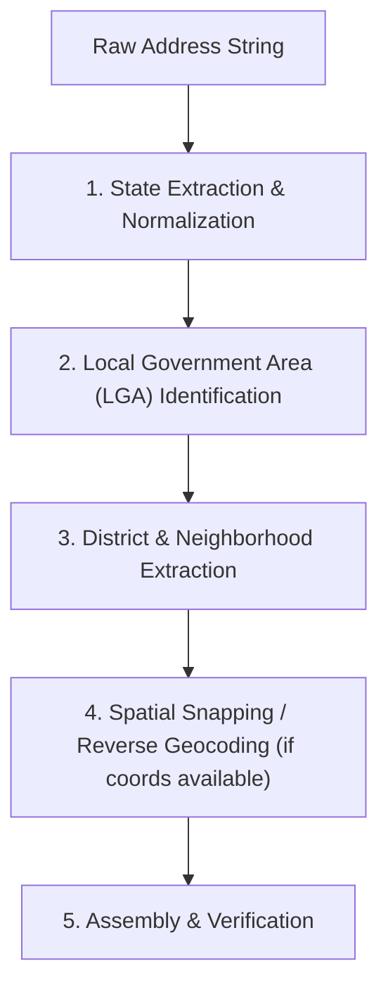

# Nigerian Address Disambiguation & NER Matching Guide

## 1. The Reality of Nigerian Addresses

Nigerian addresses rarely conform to standard Western formats like `{number} {street_name}, {city}, {postal_code}`. Common characteristics include:

- **Landmark Anchors**: "Behind First Bank, Opposite Total Filling Station", "Beside Mama Bukky Store".
- **Descriptive Estates & Phases**: "Phase 2, Site B, Kubwa, Abuja", "Magodo Phase 2, Shangisha, Lagos".
- **Cross-Streets / Junctions**: "Off Allen Avenue, Toyin Junction, Ikeja".
- **Absence of Postcodes**: Fewer than 5% of informal user inputs contain a digital postcode.

---

## 2. The 5-Stage Disambiguation Pipeline

Agents tasked with resolving an address into an 11-character digital postcode must follow this systematic pipeline:

### Stage 1: State Extraction & Normalization
Identify state references and map them to the 2-letter postal code:
- Normalize common nicknames:
  - "FCT", "Abuja", "Federal Capital" $\to$ `FC`
  - "PH", "Port Harcourt", "Pitakwa" $\to$ `RI` (Rivers)
  - "Ibadan" $\to$ `OY` (Oyo)
  - "Benin City" $\to$ `ED` (Edo)
  - "Calabar" $\to$ `CR` (Cross River)
- Use `list_states` tool to retrieve the complete mapping if needed.

### Stage 2: LGA Identification
Match administrative local government references:
- Call `list_lgas(state: "<STATE_CODE>")` to retrieve official LGAs.
- In Lagos: Ikeja, Eti-Osa, Surulere, Alimosho, Kosofe, Lagos Island, etc.
- In Abuja: Municipal (AMAC), Bwari, Gwagwalada, Kuje, Kwali, Abaji.
- LGA numbers are 2 digits (`01`-`99`). Single digits (e.g. `4`) must be padded to `04`.

### Stage 3: District & Neighborhood Extraction
- Identify the district or postal zone:
  - Examples: Victoria Island, Lekki Phase 1, Garki, Wuse 2, Maitama, Bodija, Trans-Amadi.
- If partial segments are known, invoke `autocomplete_postcode(query: "<PREFIX>")` to view matching delivery districts and areas.

### Stage 4: Coordinate Snapping (When Available)
- If GPS coordinates, delivery app pins, or Google Maps links are provided:
  - Extract `(latitude, longitude)`.
  - Call `reverse_geocode(latitude, longitude, max_distance_m: 100)` to snap to the closest active unit.

### Stage 5: Assembly & Verification
- Combine resolved segments via `assemble_postcode(state, lga, district, area, unit)`.
- If no building unit is known, default building unit candidate is `01`.
- Verify with `validate_postcode` or `diagnose_postcode`.
